<div align="center">

<!-- ░░ BOOT SEQUENCE ░░ -->


<br/><br/>


</div>

<br/>

```text
                                                                                            ┌──[ MANIFEST ]─────────────────────────────────────────────────────────┐
                                                                                            │                                                                       │
                                                                                            │  > Plataforma de gestao p/ vendedores Mercado Livre — Deployed        │
                                                                                            │    Spring Boot · Vue 3 · PostgreSQL · Docker · deploy em VPS Linux    │
                                                                                            │    uso diario pela equipe de operacoes (RBAC, analytics, bulk ops)    │
                                                                                            │  > Pesquisa quantitativa: walk-forward, PBO, Deflated Sharpe          │
                                                                                            │  > Skill em construcao: AWS                                           │
                                                                                            │                                                                       │
                                                                                            └───────────────────────────────────────────────────────────────────────┘
```

## `$ ./skillscan --sweep`

<div align="center">

</div>

## `$ render --contrib --mode 3d`

<div align="center">

</div>

## `$ ./quant --ticker HENRIQUEVMDEV/CMT`

<div align="center">


<sub><code>cada candle = 1 semana de commits · verde = mais que a semana anterior · gerado por Action própria</code></sub>

</div>

## `$ ssh henrique@anywhere`

<div align="center">

[](https://github.com/henriqueVMdev)
[](https://linkedin.com/in/SEU-LINKEDIN-AQUI)

<sub><code>connection closed by remote host. █</code></sub>

</div>
