<div align="center">

<!-- ░░ BOOT SEQUENCE ░░ -->


<br/><br/>


</div>

<br/>

```text
┌──[ MANIFEST ]────────────────────────────────────────────────────────┐
│                                                                     │
│  > Plataforma de gestao p/ vendedores Mercado Livre — em PRODUCAO   │
│    FastAPI · Vue 3 · PostgreSQL · Docker · deploy em VPS Linux      │
│    uso diario pela equipe de operacoes (RBAC, analytics, bulk ops)  │
│  > Pesquisa quantitativa: walk-forward, PBO, Deflated Sharpe        │
│  > Segundo track em construcao: Java                                │
│  > Objetivo: backend remoto -> liberdade geografica                 │
│                                                                     │
└─────────────────────────────────────────────────────────────────────┘
```

## `$ ./skillscan --sweep` `&&` `./donut`

<div align="center">
&nbsp;
</div>

## `$ systemctl status ml-platform.service`

```text
● ml-platform.service — Plataforma de gestão Mercado Livre
     Loaded: loaded (Docker Compose: fastapi + vue3 + postgres + nginx)
     Active: active (running) — produção em VPS Linux
      Users: equipe de operações, uso diário
   Features: RBAC 4 níveis · gestão em massa de compatibilidades
             analytics de vendas · logs de operação · API ML (OAuth+PKCE)
```

## `$ render --contrib --mode 3d`

<div align="center">

</div>

## `$ ./quant --ticker HENRIQUEVMDEV/CMT`

<div align="center">


<sub><code>cada candle = 1 semana de commits · verde = mais que a semana anterior · gerado por Action própria</code></sub>

</div>

## `$ cat /proc/stack`

<div align="center">


</div>

## `$ ./scan --target github.com/henriqueVMdev`

<div align="center">


</div>

## `$ ssh henrique@anywhere`

<div align="center">

[](https://github.com/henriqueVMdev)
[](https://linkedin.com/in/SEU-LINKEDIN-AQUI)

<sub><code>connection closed by remote host. █</code></sub>

</div>
